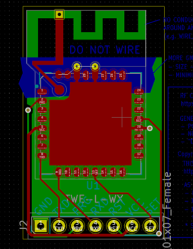
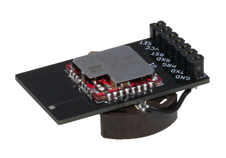
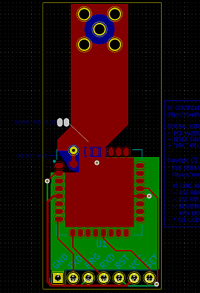
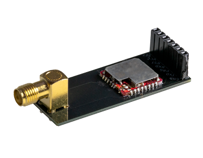

# PCB_REF_DESIGN_KICAD
TWELITE 無線マイコンの回路・基板設計（[KiCad](https://kicad.org/) 用部品データ）です。

## データのダウンロードについて

この画面上で [Code] ボタンをクリックして [Download ZIP] を選択してください。

## KiCadについて

[Library](./Library) - フットプリントライブラリ (KiCad上で参照できるように設定してください)。

KiCad 5.1.8 にて作成しています。回路図部品データ、フットプリントデータについては左記バージョンを前提としています。より旧いバージョンでは部品データなどが参照できない可能性もあります。

## 設計データ

各フォルダ内の記述を参照してください。

|                                            |                                                              |
| ------------------------------------------ | ------------------------------------------------------------ |
|                                            |                                                              |
| [逆F型パターンアンテナ](TWELITE_REV_F_ANT) | フォルダ名：TWELITE_REV_F_ANT 設計について：https://twelite.gitbook.io/general/radio-cert/design-revf-ant |
|        |  写真は、TWELITE RED、7ピンソケット（ロープロファイル）、CR2032電池ホルダー（両面テープで貼り付け、空中配線）を実装しています。 |
|                                            | 逆F型パターンアンテナは、プリント基板上で構成される小型のアンテナです。逆F型のエレメント部分とモジュール直下にあるGND面により構成されます。GND面の大きさは20x20mm～40x40mm程度が最適です。 |
|                                            |                                                              |
| [SMAコネクタ実装用基板](TWELITE_SMA_CONN)  | フォルダ名：TWELITE_SMA_CONN 設計について：https://twelite.gitbook.io/general/radio-cert/design-sma-conn |
|         |  写真は、SMAコネクタ（注：指定コネクタリスト外）、TWELITE RED、7ピンソケット（切り離しタイプ）を実装しています。 |
|                                            | SMAコネクタは無線など高周波を伝送する同軸ケーブルを接続するために用います。通常はアンテナや計測器を接続します。 |

## 設計データの取り扱いについて

 - モノワイヤレスソフトウェア使用許諾 (MW-SLA-1) を適用します。
   第１条１．で定義される本製品に含まれる「取扱説明書など」に該当します。

 - 設計データは当社（モノワイヤレス株式会社）製のモジュールを用いる（つまり当社製モジュールを実装する基板パターンの設計・基板製造を行う）限り、

   - ロイヤリティなど費用は必要ありません
   - 利用にあたり当社への連絡は必要ありません
   - 設計を流用した派生設計情報を MW-SLA-1 と共に配布することが出来ます
   - 商用・非商用関係なく利用できます
   - （上記及び仔細はMW-SLA の解釈に基づきます）

 - 設計データは、認可要件(利用できる認証等の詳細は各設計情報に記載します)に基づくものですが、お客様が適切に基板製造や部品実装を行った上で、認可要件を満足することになります。

   本設計では製造や実装に対して特記しない場合は、一般に用いられる標準公差を引用するものとします。製造業者に対しては標準的な公差による製造を指示するようにしてください。
   
- 設計データについては無保証・無サポートとします。ツール上のデータなどに瑕疵が無いこと、また性能など一切の保証はありません。部品データを用いた設計について、お客様の方でも十分注意いただくようお願い申し上げます。

- 設計データは KiCad の DRC (Design Rule Checker) を意識して作成しておりません。エラーが報告される部分もございます。

## ライセンス

[モノワイヤレスソフトウェア使用許諾契約書 (MW-SLA)](License)

