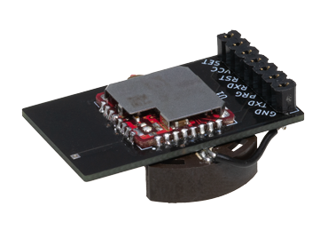

# SMAコネクタ実装プリント基板リファレンスデザイン

2021/1/29 モノワイヤレス株式会社

逆F型アンテナは、無線モジュールで広く用いられている基板パターンアンテナです。本設計データは KiCAD のフットプリントデータとして、TWELITE モジュールで利用出来るパターンアンテナ構成した基板を設計できます。

### 編集画面

### 実装例

写真は、TWELITE RED、7ピンソケット（ロープロファイル）、CR2032電池ホルダー（両面テープで貼り付け、空中配線）を実装しています。

## [設計について]
以下のリンクを参照ください。

* 逆F型アンテナガイド [[PDF, 日本語](RevF_GuideJ.pdf)]

 - 逆F型アンテナ
   https://twelite.gitbook.io/general/radio-cert/design-revf-ant

   